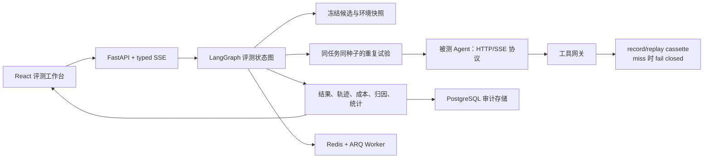

# AgentLens：可复现、可解释的 AI Agent 评测平台

> 不只判断 Agent 的最终答案“看起来是否正确”，而是回答：**这个 Agent 是否稳定到可以上线，失败发生在哪一步，结论能否复现？**

AgentLens 是一个面向工具型 Agent 的全栈评测系统。它冻结任务、候选版本、工具环境和随机种子，重复运行候选与基线，通过严格的 HTTP/SSE 轨迹协议采集证据，并分别报告成功率、稳定性、轨迹质量、成本与失败归因。

## 面试官 30 秒速览

| 关注点 | 项目中的实现 | 可验证结果 |
| --- | --- | --- |
| 评测是否可复现 | 固定 6 个任务、10 个种子、工具 cassette、候选指纹与 bootstrap seed | 无模型 Key、无外网也可重放 120 次候选/基线运行 |
| 结果是否稳定 | 分任务 Wilson 区间、分层 bootstrap、同任务同种子的配对 A/B bootstrap | v1.4 成功率 81.7%，相对 v1.3 提升 16.7 个百分点 |
| 失败是否可定位 | 保存 typed trace event，并用确定性规则定位事件区间、规则 ID 与严重级别 | 60 次候选运行持久化 488 个事件，归因为过早完成、循环调用、工具误用等 |
| LLM Judge 是否可信 | 语义裁判先过 24 条人工标注校准集，规则与裁判冲突时保留人工复核入口 | 22/24 一致，校准准确率 91.7% |
| 工程链路是否完整 | React 19 控制台 + FastAPI + LangGraph + PostgreSQL + Redis/ARQ + Docker Compose | 后端 23 项测试通过，前端可独立构建，离线基准可一键重跑 |

完整机器可读证据见 [`evidence/offline-benchmark.json`](evidence/offline-benchmark.json)，面试演示与追问索引见 [`docs/interview-guide.md`](docs/interview-guide.md)。

## 为什么做这个项目

普通 Agent Demo 往往只展示一次“成功案例”，但上线判断还需要解决四个问题：

1. 同一个任务重复运行时，成功率是否稳定？
2. 新版本的提升来自真实能力，还是随机波动？
3. 最终答案失败时，是工具误用、上下文丢失、循环、超时，还是环境本身不可用？
4. 评测结论能否在没有线上模型与真实外部服务的环境中复现？

AgentLens 的核心取舍是：**将结果正确性、轨迹质量、稳定性、成本与失败证据分开呈现，不用一个不透明的总分掩盖弱项。**

## 架构与数据流



评测状态图固定为：

```text
snapshot_environment
  → calibrate_judge
  → run_trials
  → analyze_trajectories
  → attribute_failures
  → compare_candidates
  → generate_report
```

### 关键设计

- **严格轨迹协议**：事件序号必须从 0 连续递增；首事件必须是 `run.started`；末尾必须是 `final|error → run.completed`。错误 Content-Type、乱序、重复或缺失终止事件都会归一化为协议错误。
- **环境隔离**：工具调用通过冻结 cassette 回放；回放 miss 返回 HTTP 424，绝不静默访问真实网络，避免环境漂移污染候选对比。
- **公平 A/B**：候选与基线共享任务、种子和环境快照，使用配对 bootstrap 估计差值区间，而不是只比较两个点估计。
- **证据优先的归因**：确定性规则输出事件范围、规则 ID、严重级别和解释；可选 Judge 只做复核，不把参考轨迹或 LLM 判断当作唯一真值。
- **诚实的成本统计**：只有收到 `usage` 事件才计算成本；数据不完整时明确标记，不做静默插补。
- **流式与取消语义**：实验进度使用异步 SSE；取消、客户端断开和生产者异常都有独立终止语义，异常响应不会泄露内部 traceback。

## 可复现实验结果

离线基准在 Windows 11、Python 3.12.13 上生成，外部 API 调用数为 0。

| 指标 | 候选 v1.4 | 基线 v1.3 |
| --- | ---: | ---: |
| 成功次数 | 49 / 60 | 39 / 60 |
| 成功率 | 81.7% | 65.0% |
| 95% 分层 bootstrap 区间 | [71.7%, 90.0%] | [53.3%, 76.7%] |
| 平均轨迹分 | 0.903 | 0.803 |
| 平均工具调用数 | 2.1 | 2.0 |
| 平均成本 | ¥0.040 / 任务 | ¥0.039 / 任务 |

配对差值为 **+16.7 个百分点**，95% 区间为 **[+0.8, +31.7] 个百分点**。该离线样本下区间下界高于 0，因此判定 v1.4 显著优于 v1.3。此结论只适用于固定任务集与脚本候选，不外推为真实生产模型表现。

## 三分钟运行

### Docker Compose

要求：Docker Desktop 已启动 Linux 容器引擎。

```bash
docker compose up --build
```

打开 <http://localhost:5173>。Compose 会启动 Web、API、Worker、PostgreSQL 16 和 Redis 7；默认演示不需要模型 API Key。

### 本地开发

后端：

```powershell
cd backend
python -m venv .venv
.\.venv\Scripts\python.exe -m pip install -e ".[dev]"
.\.venv\Scripts\python.exe -m uvicorn agentlens.api:app --reload --port 8000
```

前端（另一个终端）：

```powershell
cd frontend
pnpm install --frozen-lockfile
pnpm dev
```

打开 <http://localhost:5173>。本地模式使用进程内 SQLite；Docker 模式切换为持久化 PostgreSQL。可选配置见 [`.env.example`](.env.example)。

## 被测 Agent 接入协议

AgentLens 向被测服务发送 `POST /v1/agent-runs`，请求包含任务输入、随机种子、环境快照、工具网关地址和运行预算。被测服务以 `text/event-stream` 返回轨迹：

```text
event: trace
data: {"run_id":"run-42","seq":0,"type":"run.started","payload":{"seed":7}}

event: trace
data: {"run_id":"run-42","seq":1,"type":"tool.call","payload":{"name":"get_order","arguments":{"order_id":"O-8891"}}}

event: trace
data: {"run_id":"run-42","seq":2,"type":"tool.result","payload":{"name":"get_order","result":{"status":"paid"}}}

event: trace
data: {"run_id":"run-42","seq":3,"type":"usage","payload":{"input_tokens":611,"output_tokens":115,"cached_tokens":120}}

event: trace
data: {"run_id":"run-42","seq":4,"type":"final","payload":{"answer":"Eligible for refund","verified":true}}

event: trace
data: {"run_id":"run-42","seq":5,"type":"run.completed","payload":{"status":"success"}}
```

最小实现见 [`examples/scripted_agent.py`](examples/scripted_agent.py)。

## 验证与证据生成

```powershell
cd backend
.\.venv\Scripts\python.exe -m pytest -q
.\.venv\Scripts\python.exe -m ruff check --no-cache .
.\.venv\Scripts\python.exe scripts\run_offline_benchmark.py

cd ..\frontend
pnpm build

cd ..
docker compose config --quiet
```

离线基准记录运行环境、固定种子、bootstrap 配置、成功/失败计数、Judge 校准、持久化数量、耗时和规范化运行的 SHA-256 摘要。`elapsed_seconds` 仅表示本地确定性数据生成时间，不代表外部模型延迟。

## 代码导览

| 模块 | 职责 |
| --- | --- |
| [`backend/agentlens/orchestrator.py`](backend/agentlens/orchestrator.py) | LangGraph 评测流程与取消入口 |
| [`backend/agentlens/agent_client.py`](backend/agentlens/agent_client.py) | 被测 Agent HTTP/SSE 客户端与严格协议校验 |
| [`backend/agentlens/evaluation.py`](backend/agentlens/evaluation.py) | 轨迹匹配、统计区间、成本计算和失败归因 |
| [`backend/agentlens/cassette.py`](backend/agentlens/cassette.py) | 工具环境 record/replay 与 fail-closed 行为 |
| [`backend/agentlens/database.py`](backend/agentlens/database.py) | SQLAlchemy 持久化与审计计数 |
| [`frontend/src/App.tsx`](frontend/src/App.tsx) | 实验创建、SSE 订阅、取消与页面状态 |
| [`frontend/src/components`](frontend/src/components) | 稳定性图表、失败证据、完整轨迹和辅助页面 |

## 安全边界与已知限制

- AgentLens 不执行任意用户代码；被测 Agent 是外部 HTTP 服务。测试不可信候选时，仍应将候选部署在容器或 VM 中。
- record 模式只应连接操作者明确授权的服务；replay 模式不会在 cassette miss 后访问真实网络。
- 启用语义 Judge 会把配置的评测内容发送到对应 OpenAI-compatible endpoint；低置信或规则冲突必须人工复核。
- 当前是本地单用户 MVP，没有 RBAC、托管控制面、训练或自动优化能力；本地服务不应直接暴露到不可信网络。
- 内置候选与工具世界是确定性脚本，用于验证评测链路可复现，不代表生产模型质量。
- Python 依赖与容器镜像使用有界版本而非全哈希锁定；进一步的供应链加固可加入 lockfile、镜像 digest 与 SBOM。

开发细节见 [`docs/development.md`](docs/development.md)。
