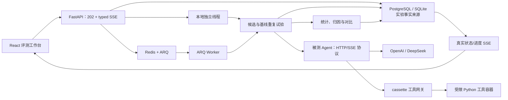

# AgentLens：可复现、可解释的 AI Agent 评测平台

> 不只判断 Agent 的最终答案“看起来是否正确”，而是回答：**这个 Agent 是否稳定到可以上线，失败发生在哪一步，结论能否复现？**

AgentLens 是一个面向工具型 Agent 的全栈评测系统。它冻结任务、候选版本、工具环境和随机种子，重复运行候选与基线，通过严格的 HTTP/SSE 轨迹协议采集证据，并分别报告成功率、稳定性、轨迹质量、成本与失败归因。

## 面试官 30 秒速览

| 关注点 | 项目中的实现 | 可验证结果 |
| --- | --- | --- |
| 评测是否可复现 | 固定 6 个任务、10 个种子、工具 cassette、候选指纹与 bootstrap seed | 无模型 Key、无外网也可重放 120 次候选/基线运行 |
| 结果是否稳定 | 分任务 Wilson 区间、分层 bootstrap、同任务同种子的配对 A/B bootstrap | v1.4 成功率 81.7%，相对 v1.3 提升 16.7 个百分点 |
| 失败是否可定位 | 保存 typed trace event，并用确定性规则定位事件区间、规则 ID 与严重级别 | 候选与基线共 120 次运行持久化 966 个事件，可回查双方原始轨迹 |
| Judge 结果是否可区分 | 离线演示使用 24 条脚本校准 fixture；未运行语义 Judge 时明确标记 `not_run` | fixture 22/24 一致；该数字不表述为真实模型准确率 |
| 工程链路是否完整 | React 19 控制台 + FastAPI + PostgreSQL + Redis/ARQ + 真实 OpenAI-compatible 候选 + 受限工具容器 | 后端 202 项、候选/工具服务 10 项测试通过；前端 7 项测试、ESLint 与生产构建通过 |

完整机器可读证据见 [`evidence/offline-benchmark.json`](evidence/offline-benchmark.json)，架构边界与演进顺序见 [`docs/architecture.md`](docs/architecture.md)，面试演示与追问索引见 [`docs/interview-guide.md`](docs/interview-guide.md)。

## 为什么做这个项目

普通 Agent Demo 往往只展示一次“成功案例”，但上线判断还需要解决四个问题：

1. 同一个任务重复运行时，成功率是否稳定？
2. 新版本的提升来自真实能力，还是随机波动？
3. 最终答案失败时，是工具误用、上下文丢失、循环、超时，还是环境本身不可用？
4. 评测结论能否在没有线上模型与真实外部服务的环境中复现？

AgentLens 的核心取舍是：**将结果正确性、轨迹质量、稳定性、成本与失败证据分开呈现，不用一个不透明的总分掩盖弱项。**

## 架构与数据流



实验使用持久化状态机：`queued → running → completed|failed|cancelled`。汇总进度与 SSE 都按候选和基线的总工作量计数（默认 120），两侧统计样本则分别从各自 60 条运行列表计算，避免进度与样本口径混用。进度写入在数据库事务内拒绝负数、超额、总量变化和完成数回退，确保 REST/SSE 只传播单调可信状态。POST 只创建排队记录并返回 HTTP 202；本地开发由独立线程执行，Docker 由 Redis/ARQ Worker 执行。Worker 与 API 不共享进程内对象，均通过数据库读取请求、抢占状态和写入进度，因此跨进程查询、取消和 SSE 使用同一事实来源。Redis job 仅携带实验 ID；滚动升级期间即使收到旧 payload，Worker 也不会用它覆盖持久请求。入队事务会深拷贝并保存完整 `TaskSpec` 列表，同时记录 benchmark、任务集、离线校准 fixture、评测器和价格表版本；Worker 只执行该快照，并要求其与持久进度总量、排队摘要和当前受支持合同一致，否则以 `invalid_execution_state` fail-closed。每个 `running` 实验还会在数据库保存执行心跳：原子抢占与每条试验进度都会续期；300 秒未续期时，`/health` 或 SSE 会将其收敛为脱敏的 `worker_lost` 失败，避免进程硬中断后永久挂起。

ARQ 模式的 `/health` 同时校验数据库连接与 migration revision、Redis `PING` 和带 TTL 的 ARQ Worker 心跳；它还会分批锁定已到期 grant、只清理超过保留期的 `expired/revoked` 记录，并在 `storage.tool_grants` 返回状态计数、本次标记/清理数、保留期与批量上限。默认保留审计记录 7 天、每次最多处理 1000 条，未到期的 active grant 不进入删除候选集。数据库不可用、Redis 不可用或 Worker 心跳缺失时均返回脱敏的 HTTP 503 与 `status=degraded`，并通过 `database_status`、`queue_status`、`worker_status` 指出故障边界。本地线程启动失败时会回滚线程注册并返回结构化 `executor_unavailable` 503；入队连接失败或任务被队列拒绝时返回 `queue_unavailable|queue_rejected` 503；这些路径都会将已创建实验持久化为 `failed`；前端会显示可行动提示和失败实验 ID，SSE 仍可读取脱敏的 `experiment.error`；事件会附带可用的权威 `failed` 实验快照，前端在同一事件回调中更新证据面板，避免只停止动画却保留旧的 `queued/running` 状态。

### 关键设计

- **严格轨迹协议**：事件序号必须从 0 连续递增；首事件必须是 `run.started`；末尾必须是 `final|error → run.completed`。非精确 `text/event-stream` MIME、乱序、重复或缺失终止事件都会归一化为协议错误；墙钟、Token、成本、工具调用、事件数和响应字节均受预算限制。
- **环境隔离**：工具调用通过冻结 cassette 回放；入队时持久化环境版本以及 `mode + records` 的规范化 SHA-256，Worker 抢占前重算合同，并通过 `AgentRunRequest` 下发摘要。被测 Agent 每次 replay 都必须回传 `cassette_content_sha256`，网关在读取响应前复验；同名内容漂移、换绑或缺失会以 `invalid_execution_state` 或 HTTP 424 拒绝，绝不静默访问真实网络。
- **公平 A/B**：候选与基线共享任务、种子和环境快照，使用配对 bootstrap 估计差值区间，而不是只比较两个点估计。
- **证据优先的归因**：确定性规则输出事件范围、规则 ID、严重级别和解释；可选 Judge 只在用户显式触发时复核，引用必须落在真实持久化事件范围内，不把参考轨迹或 LLM 判断当作唯一真值。
- **诚实的成本统计**：只有收到 `usage` 事件才计算成本；数据不完整时明确标记，不做静默插补。`cached_tokens` 必须是 `input_tokens` 的子集，缓存输入只按缓存价计费，不与完整输入价重复累计。
- **真实异步执行**：本地线程与 ARQ Worker 使用同一数据库状态机，逐条运行写入候选与基线的真实工作进度；重复 Worker 只能由 `queued` 原子抢占一次。合法最大评测的 ARQ timeout 按 50 次重复、6 个任务、候选/基线和单次 180 秒预算计算，不再受默认 300 秒任务超时误杀；Worker 协程取消会写入 `worker_interrupted` 终态，底层 `to_thread` runner 将任意非 `running` 权威状态作为协作停止信号，取消处理最多等待 2 秒完成线程回收。执行前会验证请求、候选、基线、完整任务快照、版本化评测合同与环境快照的一致性，损坏或不受支持的状态以脱敏错误落库，不会永久滞留在队列中。
- **流式与取消语义**：实验进度使用异步 SSE；同步 SQLAlchemy 读写通过工作线程卸载，取消、客户端断开和生产者异常都有独立终止语义，异常响应不会泄露内部 traceback；FastAPI 关闭时会先原子取消本地线程对应的实验，再限时等待线程退出。

## 可复现实验结果

离线基准在 Windows 11、Python 3.12.13 上生成，外部 API 调用数为 0。

| 指标 | 候选 v1.4 | 基线 v1.3 |
| --- | ---: | ---: |
| 成功次数 | 49 / 60 | 39 / 60 |
| 成功率 | 81.7% | 65.0% |
| 95% 分层 bootstrap 区间 | [71.7%, 90.0%] | [53.3%, 76.7%] |
| 平均轨迹分 | 0.903 | 0.803 |
| 平均工具调用数 | 2.1 | 2.0 |
| 平均成本 | ¥0.039 / 任务 | ¥0.038 / 任务 |

配对差值为 **+16.7 个百分点**，95% 区间为 **[+0.8, +31.7] 个百分点**。该离线样本下区间下界高于 0，因此判定 v1.4 显著优于 v1.3。此结论只适用于固定任务集与脚本候选，不外推为真实生产模型表现。

## 三分钟运行

### Docker Compose

要求：Docker Desktop 的 Linux 容器引擎可用。在 Windows 上需要启用 WSL 与
`Virtual Machine Platform`；首次启用后必须重启 Windows。

Compose 默认从相邻项目读取候选模型配置：
`../ai-coding-assistant/.env`。也可以在 AgentLens 根目录 `.env` 中用
`CANDIDATE_ENV_FILE` 指向别的位置。真实 Key 只放在这个未提交的环境文件中，
不要写入仓库或命令行历史。

DeepSeek 推荐配置：

```dotenv
LLM_PROVIDER=deepseek
DEEPSEEK_API_KEY=<your-key>
LLM_MODEL=deepseek-chat
DEEPSEEK_BASE_URL=https://api.deepseek.com/v1
JUDGE_PROVIDER=deepseek
JUDGE_MODEL=deepseek-chat
```

OpenAI 配置：

```dotenv
LLM_PROVIDER=openai
OPENAI_API_KEY=<your-key>
LLM_MODEL=gpt-4o
OPENAI_BASE_URL=https://api.openai.com/v1
JUDGE_PROVIDER=openai
JUDGE_MODEL=gpt-4.1-mini
```

启动并检查：

```powershell
docker compose up -d --build
docker compose ps
Invoke-RestMethod http://127.0.0.1:8000/health
```

打开 <http://127.0.0.1:5173>。Compose 会启动 Web、API、Worker、PostgreSQL 16、
Redis 7、候选 Agent 适配器和受限工具执行器。生产默认
`CANDIDATE_FAKE_MODEL=false`：缺少所选供应商 Key 时，候选 readiness 返回 503，
整套服务会快速失败，不会退回死数据。只有 CI 显式设置
`CANDIDATE_FAKE_MODEL=true` 来验证跨进程合同且避免产生模型费用。

页面中选择 `AI Coding Assistant` 和 `Coding Agent 核心任务集 / v1`，先点击
“测试连接”，再运行每题 3 次 smoke；这会真实调用模型 18 次，并把 SSE 轨迹、
usage、工具结果、成本与失败归因写入 PostgreSQL。Worker 会先通过一次 JSON 批量
请求让 Judge 运行 24 条人工标注校准样本；准确率不足 90% 时语义结论不进入通过
门槛。正式评测可切换为每题 10 次。

一次性 `migrate` 服务会先执行 `alembic upgrade head`；Worker 在迁移成功且 Redis
健康后启动，API 等待 Worker 健康后启动，Web 再等待 API 健康。ARQ 模式
`/health` 会校验数据库 revision、Redis readiness 与 Worker freshness。

### 本地开发

后端：

```powershell
cd backend
python -m venv .venv
.\.venv\Scripts\python.exe -m pip install -e ".[dev]"
.\.venv\Scripts\python.exe -m uvicorn agentlens.api:app --reload --port 8000
```

前端（另一个终端）：

```powershell
cd frontend
pnpm install --frozen-lockfile
pnpm dev
```

打开 <http://localhost:5173>。本地模式使用共享内存 SQLite 与独立执行线程；Docker 模式切换为 PostgreSQL、Redis 与独立 ARQ Worker。可选配置见 [`.env.example`](.env.example)。

### 内置真实 Coding Agent 与自定义 HTTP Agent

Compose 中的 `candidate-agent` 是真实 OpenAI-compatible 适配器，支持 OpenAI 与
DeepSeek Tool Calling。前端创建的生产测评固定使用 `execution_mode=http`，不会静默
切换 scripted fixture。适配器把模型工具调用路由到 AgentLens 授权网关，并输出严格
的 typed SSE；DeepSeek 请求不会发送未文档化的 `seed` 参数，但 trial seed 仍会进入
实验快照与轨迹，供重复运行分组和统计使用。

要验证其他自定义 HTTP/SSE Agent，可先在仓库根目录启动合同示例：

```powershell
.\backend\.venv\Scripts\python.exe -m uvicorn scripted_agent:app --app-dir examples --port 8001
```

启动 API 前配置候选端点；候选与基线可以指向不同服务：

```powershell
$env:AGENT_ENDPOINTS='{"support-v1.4":"http://127.0.0.1:8001","support-v1.3":"http://127.0.0.1:8001"}'
cd backend
.\.venv\Scripts\python.exe -m uvicorn agentlens.api:app --port 8000
```

`AGENT_ENDPOINTS` 是给内置候选补端点的简写。评估任意候选时，应通过 `CANDIDATE_OVERRIDES` 提供完整、可审计的身份元数据；映射键必须和内部 `id` 一致：

```powershell
$env:CANDIDATE_OVERRIDES=@'
{"remote-v2":{"id":"remote-v2","name":"Remote Support Agent","version":"2026.08","model":"provider/model-v2","model_parameters":{"temperature":0.1},"prompt_hash":"sha256:replace-with-real-hash","scaffold_version":"support-flow@2.0.0","tool_schema_hash":"sha256:replace-with-real-hash","endpoint":"http://127.0.0.1:8001"}}
'@
```

动态候选只允许用于 `http` 模式；scripted fixture 仅保留给离线回归和可复现证据，
不是产品界面的默认数据源。端点必须是无内嵌凭据、query 或 fragment 的绝对
HTTP(S) URL。

提交一轮 HTTP 模式实验：

```powershell
$body = @{ prompt='HTTP Agent 合同验证'; execution_mode='http'; repetitions=1 } | ConvertTo-Json
Invoke-RestMethod http://127.0.0.1:8000/api/v1/experiments -Method Post -ContentType application/json -Body $body
```

缺失或非法端点会在入队前返回结构化 HTTP 422。运行中的网络、HTTP、协议、预算和超时错误会保存为失败轨迹；取消实验会终止正在等待的 Agent 请求。

## 按需语义 Judge 复核

确定性规则始终先生成失败类别、事件范围和解释，语义 Judge 不会在创建实验、后台执行或页面加载时自动运行。只有用户在失败证据面板点击“语义复核”，或显式调用下列 API，系统才会把指定失败及其归因范围内的持久化事件发送到配置的 OpenAI-compatible endpoint；这可能产生模型费用，并应按所用端点的数据政策处理评测内容。

```powershell
$env:OPENAI_BASE_URL='https://api.openai.com/v1'
$env:OPENAI_API_KEY='在本地环境安全设置，不要写入仓库'
$env:JUDGE_MODEL='gpt-4.1-mini'
$env:JUDGE_MAX_CONTEXT_BYTES='131072'
Invoke-RestMethod `
  'http://127.0.0.1:8000/api/v1/experiments/exp-demo-0248/runs/<run-id>/failures/0/review' `
  -Method Post
```

`failure_index` 从 0 开始。数据库租约会在同一事务中核对 `ExperimentRecord.metrics.summary`、`RunRecord.result` 与独立 `EventRecord` 中该失败范围的完整事件（包括 span lineage）；API 只从核验后的租约上下文组装事件，并在创建外部客户端前递归脱敏 `authorization`、`api_key`、`password`、`token`、cookie 等凭据形态字段，再按 UTF-8 字节数执行 `JUDGE_MAX_CONTEXT_BYTES` 上限；其他评测内容仍会发送。Judge 必须引用输入中真实存在的事件序号；引用会去重排序。`supported=true` 且类别一致时记为 `support`，否则记为 `conflict`。确定性 `explanation` 永远保留，Judge 的解释与事件引用写入独立字段；实验摘要和单次运行审计记录在同一数据库事务内同步更新，失败类别计数不会被语义复核改写。

未配置 Key 时返回 `judge_unavailable` 503 且不创建外部客户端；实验未完成时返回 `review_not_ready` 409；上下文超限在外部调用前返回 `judge_context_too_large` 413；超时返回 `judge_timeout` 504；非法结构化结果或事件引用返回 `judge_invalid_response` 502。上述失败都不会覆盖原有 `not_run`，外部异常详情也不会回传给客户端。

每次可能产生费用的调用都会先核对实验摘要、独立运行记录和事件审计行一致，再在实验记录中原子领取带过期时间的复核租约。OpenAI 客户端显式设置 `max_retries=0`，一次复核请求不会在 SDK 内部扩张成多次外部请求；可重试错误只通过结构化 `retryable` 返回给调用方。同一失败已有活动请求时返回 `review_in_progress` 409，不会调用第二次模型；已有复核结果时，普通 POST 返回 `review_already_exists` 409。只有显式追加 `?force=true` 才会重新调用并更新 Judge 字段，前端会再次确认费用。模型失败或引用无效会释放租约，进程崩溃遗留租约则在 Judge 超时加 30 秒后允许接管；旧请求的 token 不能释放或提交后来请求的租约。

## 被测 Agent 接入协议

AgentLens 向被测服务发送 `POST /v1/agent-runs`，请求包含任务输入、随机种子、环境快照、cassette 内容摘要、工具网关地址和运行预算。关键环境字段如下：

```json
{
  "environment_snapshot": "customer-tools-v2:cassette-2026-08-12",
  "cassette_content_sha256": "35e9f0c3c6ad9da38aa2ee80c0f597c514269ee31bd8c4b6aaba608e279de7c5",
  "tool_grant_token": "<opaque-run-scoped-token>",
  "tool_gateway_url": "http://127.0.0.1:8000/api/v1/tools/invoke"
}
```

被测 Agent 调用 `tool_gateway_url` 时必须把收到的 `run_id`、`tool_grant_token` 与 `cassette_content_sha256` 原样放入每个 replay 请求。Worker 为每条 HTTP trial 生成 256-bit opaque token，数据库只保存 SHA-256，并绑定 run、cassette 内容、任务 allowlist、`max_tool_calls` 与墙钟预算加 30 秒宽限；每次调用在行锁事务中扣减，trial 成功、失败或取消都会撤销。撤销和到期记录默认保留 7 天供审计，随后由健康维护路径以行锁和有界批量清理；可通过 `TOOL_GRANT_RETENTION_SECONDS`（3600–31536000）与 `TOOL_GRANT_CLEANUP_BATCH_SIZE`（1–10000）调整。缺失或格式错误返回脱敏 422，跨 run、错摘要、越权工具和撤销/过期 token 返回 403，预算耗尽返回 429，cassette miss 返回 424。被测服务以 `text/event-stream` 返回轨迹：

```text
event: trace
data: {"run_id":"run-42","seq":0,"type":"run.started","payload":{"seed":7}}

event: trace
data: {"run_id":"run-42","seq":1,"type":"tool.call","payload":{"name":"get_order","arguments":{"order_id":"O-8891"}}}

event: trace
data: {"run_id":"run-42","seq":2,"type":"tool.result","payload":{"name":"get_order","result":{"status":"paid"}}}

event: trace
data: {"run_id":"run-42","seq":3,"type":"usage","payload":{"input_tokens":611,"output_tokens":115,"cached_tokens":120}}

event: trace
data: {"run_id":"run-42","seq":4,"type":"final","payload":{"answer":"Eligible for refund","verified":true}}

event: trace
data: {"run_id":"run-42","seq":5,"type":"run.completed","payload":{"status":"success"}}
```

可运行实现见 [`examples/scripted_agent.py`](examples/scripted_agent.py)，其六个任务的 HTTP/SSE 合同由后端端到端测试直接验证。

## 验证与证据生成

```powershell
cd backend
.\.venv\Scripts\python.exe scripts\verify_repository_hygiene.py
.\.venv\Scripts\python.exe -m pytest -q
.\.venv\Scripts\python.exe -m ruff check --no-cache .
.\.venv\Scripts\python.exe scripts\run_offline_benchmark.py

cd ..\frontend
pnpm lint
pnpm test
pnpm build

cd ..
docker compose config --quiet
```

真实基础设施验收需要可用的 Docker Linux Engine。脚本会等待 API 就绪，验证 fail-closed 工具 miss、API → Redis/ARQ Worker → PostgreSQL 的完成路径、唯一 SSE 终止事件、取消不被覆盖以及审计计数增量，并输出首事件与完成耗时：

```powershell
# 在仓库根目录执行
try {
  docker compose -p agentlens_verify up -d --build postgres redis api worker
  docker compose -p agentlens_verify exec -T -e AGENTLENS_VERIFY_OUTPUT=/tmp/agentlens-compose-verification.json api python scripts/verify_compose_stack.py
  docker compose -p agentlens_verify cp api:/tmp/agentlens-compose-verification.json evidence/compose-verification.local.json
} finally {
  docker compose -p agentlens_verify down -v --remove-orphans
}
```

GitHub Actions 工作流 [`.github/workflows/ci.yml`](.github/workflows/ci.yml) 在 push、pull request 和手动触发时并行执行后端脱敏仓库卫生扫描、Ruff/测试/离线摘要、前端冻结安装/ESLint/Vitest/生产构建，以及 Ubuntu runner 上真实的 PostgreSQL + Redis + ARQ Compose E2E。工作流权限仅为 `contents: read`，不注入模型 Key；Compose job 显式设置 `CANDIDATE_FAKE_MODEL=true`，但仍通过 readiness 指纹握手和 `execution_mode=http` 走候选 SSE、工具网关与跨进程持久化主链路，不把外部 API 波动与费用带入 CI。pnpm 固定为 11.19.0，只有 esbuild 获准运行依赖构建脚本。验收器还会回填一个超过保留期的终态 grant，并要求健康维护路径报告实际清理；随后对同一失败连续发起两次无 Key 复核，要求两次均返回非重试型 `judge_unavailable` 503，以证明失败路径已释放数据库租约且确定性证据未改变。验收器仅在全部检查通过后原子写入 schema 为 `agentlens-compose-verification/v7`、包含候选运行时身份、Python/平台信息、grant retention 证据与耗时的 JSON。工作流会在 GitHub Ubuntu runner 内构建并启动栈、在 API 容器中运行同一验收器，将结果上传为 `agentlens-compose-verification` artifact，失败时输出日志并始终删除 volume。

离线基准记录运行环境、固定种子、bootstrap 配置、成功/失败计数、Judge 校准、持久化数量、耗时、版本化评测合同、完整 `TaskSpec` SHA-256、冻结 cassette 内容 SHA-256 与规范化运行 SHA-256。CI 同时断言任务指纹、cassette 合同和运行摘要。`elapsed_seconds` 仅表示本地确定性数据生成时间，不代表外部模型延迟。

## 代码导览

| 模块 | 职责 |
| --- | --- |
| [`backend/agentlens/api.py`](backend/agentlens/api.py) | `create_app()` 组合根、lifespan、异常处理和领域 router 装配 |
| [`backend/agentlens/routers`](backend/agentlens/routers) | health、experiments、reviews、tools 的独立 REST/SSE 传输边界 |
| [`backend/agentlens/store.py`](backend/agentlens/store.py) | 数据库驱动状态机、冻结任务/版本合同校验、registry 注入、线程执行与 SSE |
| [`backend/agentlens/worker.py`](backend/agentlens/worker.py) | ARQ ctx 生命周期依赖、跨进程任务入口与线程卸载 |
| [`backend/scripts/verify_compose_stack.py`](backend/scripts/verify_compose_stack.py) | Compose 跨进程完成、取消、grant retention、离线 Judge 租约、SSE 与审计增量验收 |
| [`backend/scripts/verify_repository_hygiene.py`](backend/scripts/verify_repository_hygiene.py) | 脱敏检查秘密文件、常见 token 与本地绝对路径 |
| [`backend/agentlens/agent_client.py`](backend/agentlens/agent_client.py) | 被测 Agent HTTP/SSE 客户端、取消清理与严格协议校验 |
| [`backend/agentlens/runtime.py`](backend/agentlens/runtime.py) | scripted/HTTP 统一运行结果适配、错误归一化与状态断言 |
| [`backend/agentlens/execution_contract.py`](backend/agentlens/execution_contract.py) | 冻结评测快照的集中构造、强类型恢复与版本/内容漂移拒绝 |
| [`backend/agentlens/evaluation.py`](backend/agentlens/evaluation.py) | 轨迹匹配、统计区间、成本计算和失败归因 |
| [`backend/agentlens/cassette.py`](backend/agentlens/cassette.py) | 工具环境 record/replay、规范化内容指纹与 fail-closed 行为 |
| [`backend/agentlens/database_core.py`](backend/agentlens/database_core.py) | 共享 engine/session、进程内事务锁和 UTC 规范化 |
| [`backend/agentlens/tool_grant_repository.py`](backend/agentlens/tool_grant_repository.py) | run-scoped grant 签发、原子消费、撤销和有界 retention |
| [`backend/agentlens/experiment_repository.py`](backend/agentlens/experiment_repository.py) | 实验、运行、事件持久化与状态机事务 |
| [`backend/agentlens/review_repository.py`](backend/agentlens/review_repository.py) | Judge 三层证据核验、租约与原子双写事务 |
| [`backend/agentlens/database.py`](backend/agentlens/database.py) | 旧导入路径的纯兼容 facade，不承载事务实现 |
| [`frontend/src/App.tsx`](frontend/src/App.tsx) | 实验创建、SSE 订阅、取消与页面状态 |
| [`frontend/src/components`](frontend/src/components) | 稳定性图表、失败证据、完整轨迹和辅助页面 |

## 安全边界与已知限制

- 内置 `tool-runner` 会执行任务中的 Python 代码，但它只是 **受限执行 / best-effort isolation**，不是能安全运行恶意代码的沙箱。它使用静态策略、独立子进程、隔离模式、超时后进程组终止、输出上限和精简子进程环境；Compose 另外使用非 root 用户、只读文件系统、tmpfs、capability drop、`no-new-privileges`、CPU/内存/PID 限制。它不能替代专用沙箱、VM、seccomp 或微虚拟机；不要把不可信攻击代码交给本地部署执行。
- 测试不可信候选时，应将候选部署在单独容器或 VM 中。Agent 与工具网关端点只能通过受控环境配置提供，且拒绝内嵌凭据、query 和 fragment；工具网关 URL 还会在运行协议和持久化恢复边界复验。run-scoped 工具 token 只在 trial 请求中下发，服务端仅保存哈希；422 验证错误删除原始输入，授权错误不回显 token。被测 Agent 仍属于 token 持有者，应避免记录请求正文。
- record 模式只应连接操作者明确授权的服务；replay 模式不会在 cassette miss 后访问真实网络。
- `judge.py` 提供显式按需的 OpenAI-compatible 语义复核；后台主链路和 CI 始终保持离线 `not_run`。只有用户点击或调用复核 API 且配置 Key 时才发送失败归因范围内的事件并产生潜在费用；凭据键脱敏和上下文限额降低暴露面，但不构成通用 PII 清洗。租约独占、过期接管、默认幂等、显式重复确认、三层证据核验、span lineage、禁用隐式重试、引用校验、严格响应验证、超时、客户端关闭、脱敏错误和原子双写已有测试。真实人工标注校准集仍是后续工作。
- 当前是本地单用户 MVP，没有 RBAC、托管控制面、训练或自动优化能力；本地服务不应直接暴露到不可信网络。
- 离线 scripted 候选只用于测试评测器自身的可复现性；真实 Coding Agent 测评会调用所配置的模型供应商，结果受模型版本、网络和供应商服务状态影响。
- Python 直接依赖声明了最低版本和兼容主版本上界，Node 使用冻结 lockfile，容器镜像固定主版本标签；但 Python 尚无全哈希 lockfile，镜像也未固定 digest，进一步加固仍需加入哈希锁、镜像 digest 与 SBOM。

开发细节见 [`docs/development.md`](docs/development.md)。
