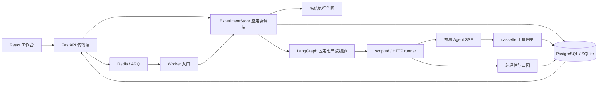

# AgentLens 架构审计与演进边界

审计日期：2026-08-24。本文以当前代码、测试和运行入口为事实来源，不把规划中的能力描述为已实现。

## 1. 系统定位

AgentLens 是一个可离线复现的 Agent A/B 评测平台。它把候选/基线重复运行、冻结工具环境、严格 SSE 轨迹、确定性归因、可选语义复核和统计比较串成一条可审计链路。



数据库是实验状态、进度、运行结果、事件和授权审计的唯一事实来源；Redis 只传实验 ID，不承载可覆盖数据库的执行 payload。

## 2. 当前分层与职责

| 层 | 模块 | 当前职责 |
| --- | --- | --- |
| 传输层 | `api.py`, `routers/health.py`, `routers/experiments.py`, `routers/reviews.py`, `routers/tools.py`, `agent_client.py` | 应用组合、按领域 REST/SSE 输入输出、HTTP 被测 Agent 协议、错误映射 |
| 应用协调层 | `store.py`, `worker.py`, `runtime.py`, `orchestrator.py` | 状态机协调、线程/ARQ 入口、LangGraph 固定七节点编排、trial 生命周期、取消传播 |
| 执行合同层 | `execution_contract.py` | 构造不可变评测快照、恢复并验证强类型执行合同 |
| 领域层 | `schemas.py`, `evaluation.py`, `pricing.py` | DTO、不变量、统计、轨迹评分、归因与成本 |
| 适配器层 | `database_core.py`, `experiment_repository.py`, `review_repository.py`, `tool_grant_repository.py`, `database.py`, `tool_gateway.py`, `cassette.py`, `judge.py` | 共享事务设施、bounded-context 持久化、冻结工具回放、可选模型复核 |
| Fixture/演示 | `demo.py` | 固定候选、任务、失败分布和离线 runner |
| 展示层 | `frontend/src` | 实验创建、SSE 状态、证据与轨迹展示 |

允许的主要依赖方向是：

```text
transport -> application -> contract/domain
                         -> adapter ports
adapter implementations -> domain schemas
```

持久化适配器不得反向导入 HTTP 工具网关或应用 Store；执行合同模块不得导入数据库或 Store。`test_execution_contract.py` 与 `test_database_architecture.py` 用 AST 和对象身份检查锁定合同、共享核心、repository 与兼容 facade 的依赖方向。

## 3. 状态与一致性边界

### 实验状态

`queued -> running -> completed|failed|cancelled` 只通过数据库事务迁移。API、Worker 和 SSE 都从持久状态读取，不使用进程内对象作为跨进程事实来源。

### 冻结执行合同

入队时一次性冻结以下内容：

- 完整 `TaskSpec` 列表与候选/基线指纹；
- benchmark、任务集、校准、评估器和价格表版本；
- cassette ID、版本、内容 SHA-256；
- execution mode 与经过 URL 安全校验的工具网关地址；
- 原始、已验证的 `ExperimentRequest`。

Worker 抢占前由 `execution_contract.validate_execution_contract()` 一次性恢复为 `ExecutionContract`。任何字段缺失、版本漂移、候选错配、任务总量变化、cassette 内容变化或危险 URL 都在 runner 前 fail-closed 为 `invalid_execution_state`。

### 工具授权

每个 HTTP trial 使用只落 SHA-256 的 run-scoped opaque grant。调用预算在行锁事务中扣减；跨 run、错 cassette、错内容摘要、越权工具、过期或撤销授权都会拒绝。终态授权默认保留 7 天供审计，再由健康维护路径用有界批量和行锁清理。

## 4. 本次审计结论

### Must fix

1. **冻结合同职责分散** — 已完成。原先数据库负责构造快照，Store 又维护一套恢复校验，且数据库直接依赖全局 cassette registry。现已由 `execution_contract.py` 统一；数据库只深拷贝保存调用方提供的快照。
2. **授权审计无保留上限** — 已完成。已增加终态保留期、有界清理、活动授权保护、UTC 边界和健康审计证据。
3. **`database.py` 多上下文仓库** — 已完成。`database_core.py` 接管 engine、session factory、进程内锁、UTC 规范化与 schema revision 探测，`experiment_repository.py` 接管实验、运行、事件与状态机事务，`review_repository.py` 接管 Judge 三层证据核验、租约和原子双写，`tool_grant_repository.py` 接管授权签发、消费、撤销和 retention；生产调用方直接依赖对应 repository，`database.py` 仅以同一对象身份兼容旧导入且不再定义函数或类。

### Portfolio value

1. **应用组合依赖模块级单例** — 已完成。`create_app()` 只创建传输容器，不在导入时构造 Store 或 cassette；显式实例由 `app.state` 持有，默认实例在 lifespan/首请求边界用每应用可重入锁延迟创建。`ExperimentStore` 接收 registry，工具模块的旧 `registry` 路径改为延迟代理；ARQ Worker 通过 ctx 在 startup 创建 Store/registry 并在 shutdown 回收。
2. **API 路由职责偏重** — 已完成。`api.py` 只负责 lifespan、异常处理、中间件和 router 装配；health、experiments、reviews、tools 各自拥有配置、仓储和领域服务依赖，共享 Store/registry 只通过 `application_dependencies.py` 解析。router 不反向依赖组合根。
3. **前端服务器状态集中在 `App.tsx`** — 当前规模可控且已有状态同步测试；若增加分页、筛选或多人协作，再引入 query/cache 层，当前不提前增加依赖。
4. **运维指标仍以健康快照为主** — 已有结构化状态但无 OpenTelemetry/时序告警。应在真实部署需求出现后接入，避免给离线作品集引入虚假生产复杂度。

### Defer

- 多租户账号与 RBAC；
- run 级分片调度、分布式重试与大规模队列编排；
- 在线 cassette record 模式；
- 插件市场、任意代码执行或把被测 Agent 当作可信进程；
- 为当前 6×10 固定任务规模引入微服务拆分。

这些能力不会改善当前验收目标，且会扩大安全面或稀释可复现证据。

## 5. 架构决策：集中冻结合同

**决策**：数据库保存完整快照但不构造业务合同；应用协调层从配置和 cassette adapter 获取当前事实，交由纯合同模块构造；恢复时仍由同一模块校验。

**原因**：

- 避免 persistence -> tool gateway 的反向依赖；
- 构造和恢复共享同一组版本与结构不变量；
- Worker 只接收一个强类型 `ExecutionContract`，减少字符串键在 runner 边界扩散；
- 纯合同测试不需要数据库、Redis、HTTP 或模型 Key；
- 快照仍是 JSON，可由 PostgreSQL/SQLite 共同持久化，不引入迁移。

**非目标**：这不是事件溯源框架，也不允许用当前代码合同覆盖历史快照；不支持的历史版本继续 fail-closed。

## 6. 架构决策：共享数据库核心与兼容 facade

**决策**：所有 repository 依赖 `database_core.py` 提供的 engine、session factory、进程内锁和 UTC 规范化，不导入 `database.py`；Review repository 复用 experiment repository 的审计 JSON 解码辅助函数；`database.py` 只通过对象赋值重导出原 API。

**原因**：repository 之间共享同一锁与同一缓存 engine，避免拆文件后产生多个连接池或并发边界；第三方旧导入路径继续可用，生产 Store、Worker、API、runtime 与验收脚本则直接依赖对应 repository。`test_database_architecture.py` 验证 facade 与核心/repository 的对象身份、facade 无实现定义、生产依赖入口，并拒绝 repository 反向依赖 facade。

## 7. 架构决策：显式应用组合与延迟默认依赖

**决策**：`create_app()` 接受可选 ExperimentStore 与 CassetteRegistry，并把依赖实例存入应用 state；默认依赖只在 lifespan 或首请求边界构造。Store 不读取全局 registry，Worker 依赖由 ARQ ctx 生命周期持有；旧 `tool_gateway.registry` 仅作为首次访问才构造 fixture 的兼容代理。

**原因**：导入 API 不再触碰数据库或构造 cassette fixture；同一进程可创建依赖隔离的多个 FastAPI 实例；Store 使用的冻结合同 registry 与工具路由使用的 registry 是同一显式对象；Worker startup/shutdown 对依赖创建和本地线程回收负责。动态工厂测试和 AST 架构守卫会拒绝 eager Store/registry 与模块级 `worker_store` 回归。

## 8. 架构决策：领域 router 与纯组合根

**决策**：health、experiments、reviews、tools 使用独立 APIRouter 模块；`api.py` 不导入领域仓储、Demo 或 Judge，只装配 lifespan、中间件、异常处理和 routers。共享应用实例通过 `application_dependencies.py` 读取 app state。

**原因**：路由文件的依赖集合直接对应 bounded context，健康维护、实验生命周期、付费复核和工具授权不会再共享一个隐式模块命名空间；测试 monkeypatch 命中实际所有者，组合根可以独立验证零初始化。AST 守卫固定端点归属并禁止 router 反向导入 API。

## 9. 封版后条件性演进

当前架构优化计划已完成。只有在真实多进程压测表明当前实验级队列成为瓶颈时，才考虑 run 级队列分片；只有真实部署需要时才引入 OpenTelemetry、时序告警或多租户能力。

任何条件性演进仍必须保持：固定摘要不变、无外部 API 调用的默认 CI、协议失败脱敏、取消可收敛、迁移 parity、Compose 合同和前端状态测试通过。
